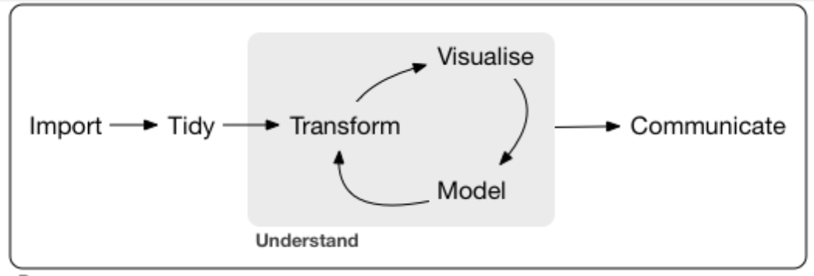

---

## Course materials

You can access the course materials quickly from

<https://laurencefrank.github.io/R>

# Goal of this course

## 1. Learn to program in R

and build the foundation for a successful scripting career.

## 2. Learn statistical programming

What is statistical programming?

Broadly speaking:

-   **Computer programming** is more focused on software development.

-   **Statistical programming** is more focused on data analysis and the
    communication of the results.

In this course we focus more on the HOW of doing data analysis in R. It is not primarily a course in statistics. This course serves as a preparation for e.g. the Summerschool Utrecht course "Data Analysis".

[Source figure: R for Data
Science](https://r4ds.had.co.nz/introduction.html)

## First introduction to R

### `R`

### `RStudio`

### Organise your work with `R Markdown` and `RStudio projects`

## What is R?

### Software

## The origin of R

-   R is a language and environment for statistical computing and for
    graphics

-   GNU project (100% free software)

-   Managed by the R Foundation for Statistical Computing, Vienna,
    Austria.

-   Community-driven

-   Based on the object-oriented language S (1975)

## What is `RStudio`?

**Integrated Development Environment (IDE)**

[Source figure: R for Data Science](https://r4ds.had.co.nz/introduction.html)

### `RStudio`

-   Aggregates all convenient information and procedures into one single
    place
-   Allows you to work in projects
-   Manages your code with highlighting
-   Gives extra functionality (Shiny, knitr, markdown, LaTeX)
-   Allows for integration with version control routines, such as Git.

## Writing code with `R Markdown`

R Markdown provides an authoring framework for data analysis. You can
use a single `R Markdown` file to:

1.  Save and execute code;
2.  Generate high quality reports that can be shared with collaborators and a broader audience.

R Markdown documents are fully reproducible and are able to generate
many file formats: 

* MS Word document 
* PDF 
* HTML (webpage) 
* slide show
* book 
* dashboard

[RStudio provides an introduction to `R Markdown` here](<https://rmarkdown.rstudio.com/index.html>)

## Demo of `R Markdown`

## Use `RStudio Projects`

Every time you start a new (data analysis) project, make it a habit to create a new `RStudio Project`.

**Because you want your project to work:**

-   not only now, but also in a few years;
-   when the folder and file paths have changed;
-   when collaborators want to run your code on their computer.

`RStudio Projects` create a convention that guarantees that the project
can be moved around on your computer or onto other computers and will
still "just work".

## Example data analysis project with `RStudio project`

Every time you want to work on this project: open the project by
clicking the `.Rproj` file.

## Practical A

Time for your first practical in R!

1. Go to: <https://laurencefrank.github.io/R/> and select the tab "Monday". There you will find the following files:
    + Two versions of the lecture: the slides and the handout version.
    + "Practical A: Exercises" provides the exercises of the practical.
    + "Practical A: template" is an `R Markdown` file with the exercises and empty code chunks where you can type your answers. 
    + "Practical A: solutions" (a HTML file) provides the answers. 
2. Download the "Practical A: template file" and save it in a new folder with name "RSummer2023", for example.
3. Open `RStudio` and choose File -> New Project. Choose the option "Existing Directory". Find the Project Working Directory, the folder "RSummer2023" you just created. Click on "Create project".
4. Open the "Practical_A_template.Rmd" with File -> Open File. 
5. Go to the course website, select the tab "Monday" and click on "Practical A: Exercises" to get the instructions and the exercises. 

## Practical A
Aim to make the exercises without looking at the answers and use the solutions file to evaluate your work. 

But, do not 'struggle' too long because you will run out of time. 

**In any case, ask for help when you feel help is needed.**

