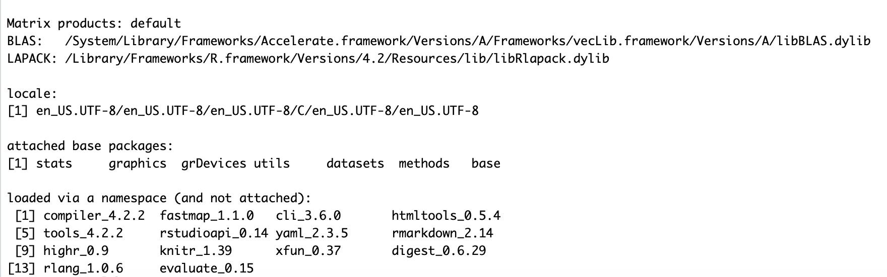
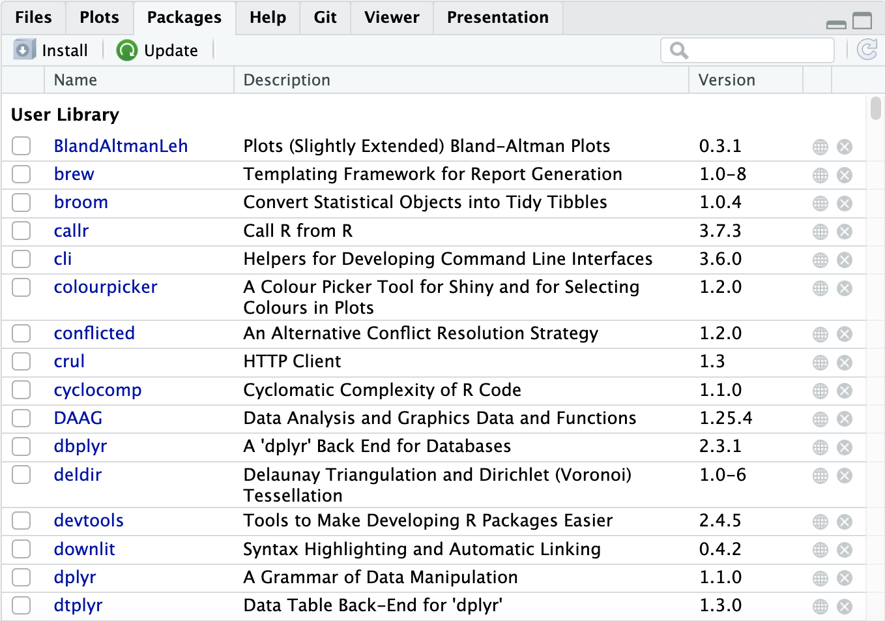
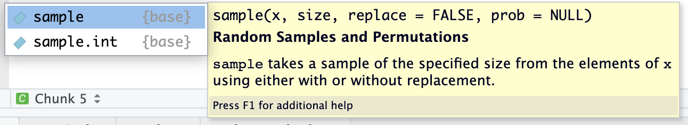
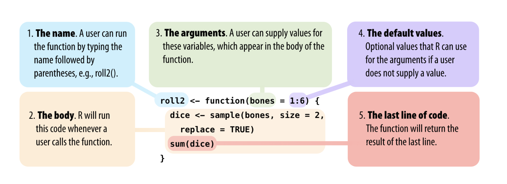
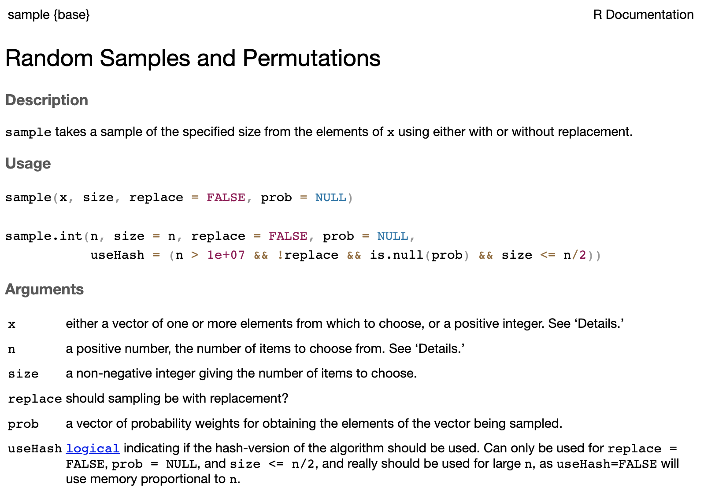
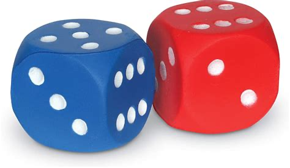

<style type="text/css">

body{ /* Normal  */
      font-size: 12px;
  }
td {  /* Table  */
  font-size: 12px;
}
h1.title {
  font-size: 18px;
  color: DarkBlue;
}
h1 { /* Header 1 */
  font-size: 18px;
}
h2 { /* Header 2 */
    font-size: 18px;
}
h3 { /* Header 3 */
  font-size: 18px;
}
code.r{ /* Code block */
    font-size: 12px;
}
pre { /* Code block - determines code spacing between lines */
    font-size: 14px;
}
</style>

---

## So far

This morning we have learned the basics of programming in `R`:

- assign elements to objects with `<-` (alt/option -)
- work with `RStudio` and `R Markdown`
- run code
- organize your work with projects in `RStudio`

```{r echo=FALSE}
set.seed(123)
```

## Topics

* R packages
* Getting help
* Functions
* R objects and data types
* Data manipulation: subsetting and logical operators


# R Packages

## R Packages: base installation

* When you start `RStudio` and `R` only the base packages are activated: the basic installation with basic functionality.
* There are almost 20.000 packages that have been developed by R users all over the world. See the [Comprehensive R Archive Network (CRAN)](https://cran.r-project.org/web/packages/)
* Not efficient to have all these packages installed every time you use R. Install only the packages you want to use.

Use `sessionInfo()` to see which packages are active. This is how the basic installation looks like:

<center>

</center>

## How to work with packages

Packages are like apps on your mobile phone.

* When you want to use a package for the first time, you have to install the package.
* Each time you want to use the package, you have to load (activate) it.

## Installing packages

The easiest way to install a package, e.g. mice, is to use:
```{r eval=FALSE}
install.packages("mice")
```

Alternatively, you can also do it in `RStudio` through:

`Tools -> Install Packages`

An overview of the packages you have installed, see the tab “Packages” in the output pane:

<center>

</center>

## Loading packages

There are two ways to load a package in `R`:
```{r eval=FALSE}
library(mice)
```

and

```{r eval=FALSE}
require(mice)
```

When a package is not found (not installed):

* `require()` will produce a warning but will continue to run the rest of the code.
* `library()` will produce an error and stop running the rest of the code.

# Getting help

## Getting help when you know the function or package

Everything that is published on the Comprehensive `R` Archive Network (CRAN) and is aimed at `R` users, must be accompanied by a help file.

*In the search bar of the output pane:*

* type name of the function or package

*In the console:*

* type `help(sample)` or `?sample` (opens a help window).
* type `help(package=mice)` for packages
* when you start typing `sample` in console or editor (Markdown code chunk) a pop-up window appears with help about the structure of the function.

<center>

</center>

## Getting help when you do not know the function or package

* Type your search term in the search bar of the output pane.

* In the console:
    + Type `??` followed by your search term.
    + For example `??anova` returns a list of all help pages that contain the word ‘anova’.

* Some packages have cheat sheets, see in `R Studio`, `Help menu -> Cheat Sheets`

* Google the search term(s) and add ‘R’ as keyword.

* Helpful websites: <http://www.stackoverflow.com> and <http://www.stackexchange.com>


# Functions

## Functions in R

* Functions are the building blocks of `R`

* Built-in or user-defined (programme your own functions).

* To use a function, type the function name with parentheses: `mean()`

* Typing the name of the function without the parentheses reveals the code of the function.

<center>

</center>


## The structure of functions in R

Every function in R has the following structure:

<center>

</center>

<sup>
[Image source: Garrett Grolemund, Hands-On Programming with R, 2.6](https://rstudio-education.github.io/hopr/basics.html#functions)
</sup>


## Using R functions: arguments

When you want to use a function in R, you need to know which information you need to provide to the function. 

For example the function `sample()`

Use `args(<function name>)` to obtain info about the arguments and the default values: 

```{r}
args(sample)
```


Or make use of the pop-up help and use the TAB key to cycle through the arguments:

<center>

</center>

## Using R functions: help file

Clicking `F1` opens the help file of the function `sample()`:

<center>

</center>

## Using R funtions: arguments

Now we can use the function to, for example, mimic the sampling of two dice.

```{r}
dice <- sample(1:6, size=2, replace=TRUE)
dice
```

`x` represents the items to sample from (the range of possible items). In this case the numbers 1 to 6 (the eyes of single die).

`size` is the number of items to choose, in this case 2

`replace=TRUE` means sampling with replacement



## Using function arguments

Will the function work if we leave out the argument names and give only the values?

```{r}
dice <- sample(1:6, 2, TRUE)
dice
```

And if we change the order of the values?
```{r error=TRUE}
dice <- sample(2, 1:6, TRUE)
dice
```
## Using function arguments

Changing the order is possible only when the argument is mentioned. 
```{r}
dice <- sample(size=2, x=1:6, replace=TRUE)
dice
```
**Recommendation: type out the arguments and their values. This prevents errors and increases the readability of your code.**


# R objects and data types

## Vector: most basic R object

A vector is an indexed set of values (a list of numbers) and has one dimension (row vector or column vector). The simplest vector has 1 element. 

`c()` creates a list of numbers:

```{r}
v1 <- c(3)
v1
v2 <- c(1:12)
v2
```

Vectors can have the following data atomic modes: *integer, numeric/double, character, logical, complex*

## Most often used data types

**Numeric (double):**
```{r}
v3 <- c(100:110)
v3
```

**Integer:**
```{r}
v4 <- c(1L:12L)
v4
```
## Most often used data types

**Character:**
```{r}
v5 <- c(letters[21:26])
v5
names <- c("Mike", "Anne", "George")
names
```

**Logical:**
```{r}
v6 <- c(TRUE, FALSE)
v6
```

## Create vectors

With `c()` 
```{r}
vector <- c(25:30)
vector
```
Simple replication with `rep()`
```{r}
rep(1:2, 3)
```
## Create vectors

Or more complex:
```{r}
rep(c("A", "B"), c(2, 3))
rep(c("A", "B"), each=3)
```
Sequence of numbers with `seq()`
```{r}
seq(from=2, to=10, by=2)
```

## Matrices
`matrix()` creates arrays with specified dimensions, e.g. vectors:
```{r}
rvect <- matrix(data=vector, nrow=6, ncol=1)
rvect
dim(rvect)
```


## Matrices

A matrix:
```{r}
(M1 <- matrix(v2, nrow=3, ncol=4))
dim(M1)
(M2 <- matrix(v2, nrow=4, ncol=3))
```

## Vectors and matrices: limitation

Vectors and matrices can only hold one data type. Remember, matrices and vectors are numerical OR character objects. They can never contain both and still be used for numerical calculations. 
```{r}
vector
v5
(newvect <- c(vector, v5))
```
## Vectors and matrices: limitation

Vectors and matrices can only hold one data type
```{r}
vector
v5
M <- matrix(cbind(vector, v5), nrow=6, ncol=2)
M
```


## Lists

Lists are flexible data structures: the elements in a list may be a combination of different data types (numeric, character) and dimensions.


```{r}
L <- list(names, vector, M)
L
```
## Assigning names to elements

Assign names to the elements of a list with `names()`. Notice the `$`.

```{r}
names(L) <-c("Names", "Numbers", "Matrix")
L
```
## Data frames

A data frame is the `R` representation of a rectangular data set where the rows are the observations and the columns the variables.

Data frames can contain both numerical and character column vectors at the same time, although never in the same column. 
```{r}
D <- data.frame("V1" = rnorm(5),
                "V2" = rnorm(5, mean = 5, sd = 2), 
                "V3" = letters[1:5])
D
```

We 'filled' a data frame with two randomly generated sets from the normal distribution - where $V1$ is standard normal and $V2 \sim N(5,2)$ - and a character set. 

## Data frames (continued)
You can name the columns and rows in data frames with `row.names`:
```{r}
row.names(D) <- c("row 1", "row 2", "row 3", "row 4", "row 5")
D
```


## Factors

* Factors are used to represent categorical data (ordered or unordered).

* A factor is a vector with integers where each integer has a label.

* Factors facilitate interpretation of results in statistical modeling: a variable with labels "male", "female" is self-describing compared to a variable with values `1`, `2`.

* Factors are very useful in statistical modeling (linear models, GLM) where they facilitate the dummy coding process of categorical variables.

## Factors

Factor objects can be created with the `factor()` function.
```{r}
x <- factor(c("male", "male", "female", "male", "female"))
x
```

Obtain the `summary` of the factor:
```{r}
summary(x)
```

## Factors 
Factors are integer vectors where each integer has a label (`levels`):
```{r}
typeof(x)
```

```{r}
attributes(x)
```

# Data manipulation: subsetting and logical operators

## Subsetting
In the basic installation of R ("base R") there are three ways to select elements from vectors, matrices, lists and data frames: 

1) **`[]`**

2) **`[[]]`**

3) **`$`**


## Subsetting with `[]`

Square brackets `[]` are used to call single elements or entire rows and columns.

`[a, b]`: **a** refers to the row number(s), **b** refers to the column number(s).

```{r}
M <- matrix(rnorm(12), nrow=3, ncol=4)
M
M[2, 3]
```

## Subsetting with `[]`

Also for data frames:

```{r}
D
D[2, 3] # Select element "b"
```
## Subsetting with `[]`

```{r}
D
D[2, ] # Select second row
D[, 1] # Select first column
```

## Subsetting with `[]`

```{r}
D
D[2:3, 2] # Select second and third row in second colum
D[1, c(2,3)] # Select elements in the first row, second and third column
```


## Subsetting with `[]`

```{r}
D
D[ , -3] # Select all rows and leave out the third column.
```

## Subsetting with `[]`

```{r}
D
D[2:3, -c(3)] # Select the second and third row minus the third column
```


## Subsetting with `[[]]`

The `[[]]` operator selects only one element

```{r}
L
L[[1]]
```

## Subsetting with `$`

Use `$` to select elements with name labels in lists or data frames:


```{r echo=FALSE}
L
```

```{r}
L$Names
```

## Subsetting with `$`

Use `$` to select a variable in a data frame:

```{r echo=FALSE}
D
```

```{r}
D$V3
```

## Logical operators
Logical operators are signs that evaluate a statement, such as `==`, `<`, `>`, `<=`, `>=`, and `|` (OR) as well as `&` (AND). Typing `!` before a logical operator takes the complement of that action. 

For example, if we would like to select elements of vector `v` that are larger than 6, we would type:
```{r }
v <- c(1:12)
v

v[v > 6]
```

## Why does a logical statement on a matrix return a vector?

```{r }
v
v > 6
```

The column values for `TRUE` may be of different length. A vector as a return is therefore more appropriate. The `TRUE` and `FALSE` values serve as indicators to select the elements in `v` larger than 6.
```{r}
v[v > 6]
```


## Logical operators

Symbol | Meaning
------ | ------
! | logical *not*
$\&$ | logical *and*
$|$ | logical *or* 
$<$ | less than
$<=$ | less than or equal to 
$>$ | greater than
$>=$ | greater than or equal to
$==$ | logical equals
$!=$ | not equal

## Integers and floating points
In R there are two types of numbers: integers and [floating point numbers](https://floating-point-gui.de/formats/fp/). Since computer memory is limited, you cannot store numbers with infinite precision. Numbers are therefore represented with floating point numbers. Floating points cannot represent decimal fractions exactly in most cases.
```{r}
(3 - 2.9)
(3 - 2.9) <= 0.1
```
Why does R tell us that `3 - 2.9 ≠ 0.1?`
```{r}
(3 - 2.9) - 0.1
```
## Floating point representation
Let's have a look at how the decimal fractions are actually represented as floating points. You can see this by asking a representation with 54 decimals.

```{r}
sprintf("%.54f",3 - 2.9)

sprintf("%.54f",0.1)

```

## How to work with floating points
The difference of 8.326673e-17 is smaller than the representable difference between two numbers whose value is close to 0.1. 

The smallest positive floating point number in R is: 2.220446e-16

```{r}
(3 - 2.9) - 0.1

 .Machine$double.eps
```

## How to work with floating points
You can verify whether the difference between two floating points is smaller than the smallest positive floating point number (2.220446e-16). 

Or use the `all.equal()` function which checks that the difference is close to the smallest floating point number.

```{r}
((3 - 2.9) - 0.1) < .Machine$double.eps

all.equal((3 - 2.9), 0.1)

```

# Practical

## Practical B

* Go to the course website and download the file "Practical B: template" (a Markdown file).

* Save the file in the project folder you created for this course, and, if necessary, open the R Project by clicking on the `.Rproj` file.

* Make the exercises, if possible without looking at the answers in the file "Practical B: solutions".

* In any case; ask for help when you feel help is needed. 
