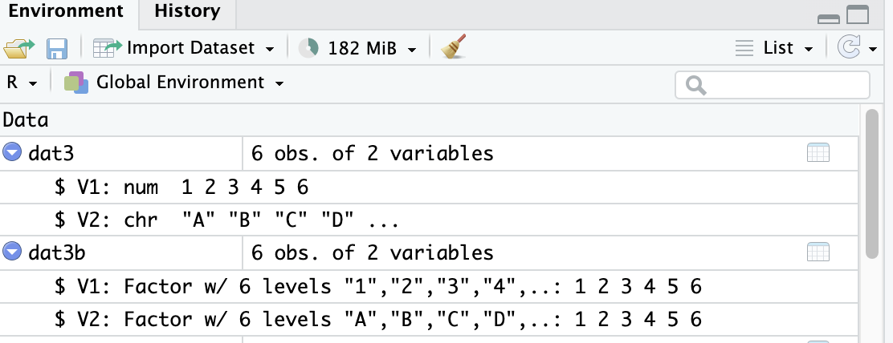

# Exercises

In this practical exercise we are going to play around with the different types of elements in R.

-   Go to the course website and download the file "Practical B: template" (a Markdown file).

-   Save the template file in the project folder you created for this course, and, if necessary, open the R Project by clicking on the `.Rproj` file.

-   Open the file "Practical B: Exercises". Make the exercises, if possible without looking at the answers in the file "Practical B: solutions".

-   In any case; ask for help when you feel help is needed.

------------------------------------------------------------------------

## Exercise 1-5

------------------------------------------------------------------------

1.  **Make two vectors: one named `vec1` with values 1 through 6 and one named `vec2` with letters A through F.**

```{r}
vec1 <- c(1, 2, 3, 4, 5, 6)
vec2 <- c("A", "B", "C", "D", "E", "F")
```

To create a vector we used `c()`, which stands for 'concatenation'. It is just a series of numbers or letters.

2.  **Create two matrices, one from `vec1` and one from `vec2`. The dimensions for both matrices are 3 rows by 2 columns. Find the function to create a matrix by typing `?matrix`**. Notice that when you start typing `?matrix` in the code chunk, a pop-up window appears with information about the function.

```{r}
?matrix
mat1 <- matrix(vec1, nrow = 3, ncol = 2)
mat2 <- matrix(vec2, nrow = 3, ncol = 2)
```

To create a matrix we used `matrix()`. For a matrix we need to specify the dimensions (in this case 3 rows and 2 columns) and the input (in this case `vec1` or `vec2`) needs to match these dimensions.

3.  **Inspect your vectors and matrices. Are all numerical?**

```{r}
vec1
vec2
mat1
mat2
```

`vec1` and `mat1` contain numbers and `vec2` and `mat2` contain characters.

------------------------------------------------------------------------

4.  **Make a matrix from both `vec1` and `vec2` with 6 rows and 2 columns. Inspect this matrix.**

```{r}
mat3 <- matrix(c(vec1, vec2), 6, 2)
mat3
```

or

```{r}
mat3b <- cbind(vec1, vec2)
is.matrix(mat3b)
mat3b
```

If one or more elements in the matrix represent characters, all other elements are also converted to characters. A matrix is just for either numeric or character elements. Notice that the second approach (the column bind approach from `mat3b`) returns a matrix where the column names are already set to the name of the bound objects.

To solve the problem of numbers represented as characters we can create a dataframe. A dataframe is essentially a matrix that allows for character elements. The use of a dataframe is often preferred over the use of a matrix in `R`, except for purposes where pure numerical calculations are done, such as in matrix algebra. However, most datasets do contain character information and a dataframe would normally be your preferred choice when working with your own collected datasets in R.


5.  **Make a dataframe called `dat3` where `vec1` and `vec2` are both columns. Name the columns `V1` and `V2`, respectively. Use function `data.frame()`.**

```{r}
dat3 <- data.frame(V1 = vec1, V2 = vec2)
dat3
```

------------------------------------------------------------------------

## Exercise 6-10

------------------------------------------------------------------------

6. **A useful function to check the properties of any R object is the `str()` function. Try this function on `dat3`.**

You can inspect the structure of a dataframe (or other R object) by using the `str()` function or by clicking on the object in the Environment tab in `RStudio`, which unfolds the properties of each element. See:

<center></center>

Try both ways of inspecting the structure of `dat3`.

```{r}
str(dat3)
```

Inspecting the structure of your data is vital, as you probably have imported your data from some other source. If we, at a later stage, start analyzing our data without the correct measurement level, we may run into problems. One problem that often occurs is that categorical variables (factors in `R`) are not coded as such.

------------------------------------------------------------------------

7.  **Select 1) the third row, 2) the second column and 3) the intersection of these two in the dataframe `dat3` that you have created in Question 4.**

```{r}
dat3[3, ] #3rd row
dat3[, 2] #2nd column
dat3$V2   #also 2nd column
dat3[3, 2] #intersection
```

The `[3, 2]` index is very useful in 'R'. The first number (before the comma) represents the row and the second number (after the comma) represents the column. For a vector there are no two dimensions and only one dimension can be called. For example, `vec1[3]` would yield `3`. Try it.

Columns can also be called by the `$` sign, but only if a name has been assigned. With dataframes assigning names happens automatically.


8.  **Imagine that the first variable `V1` in our dataframe `dat3` is not coded correctly, but actually represents grouping information about cities. Convert the variable to a factor and add the labels Utrecht, New York, London, Singapore, Rome and Cape Town.**

```{r}
dat3$V1 <- factor(dat3$V1, labels = c("Utrecht", "New York", "London", "Singapore", "Rome", "Capetown"))
dat3
```

You can verify the changes with `str()` or by inspecting the object `dat3` in the RStudio Environment tab.

9. **Open the workspace `boys.RData`.**

There are two ways to go about opening workspaces that are available on the internet. You either need to download the `boys.RData` file from the course page and put it in the project folder. Then run the below code

```{r}
load("boys.RData")
```

or double-click the `boys.RData` file on your machine (right-click and `open with RStudio` if it does not open by default in `RStudio`, but in `R`).

Alternatively, you can import workspaces directly from the internet by running and loading the connection

```{r eval = FALSE}
con <- url("https://www.gerkovink.com/fundamentals/data/boys.RData")
load(con)
```

In the above code we store the connection in object `con` and then load the connection with `load(con)`.

10. **Most packages have datasets included. Since we have not learned to load packages yet, you are presented with such a data set in a workspace. Open the `boys` dataset (it is from package `mice`, by the way) by typing `boys` in the console, and subsequently by using the function `View()`.**

The output is not displayed here as the data set is simply too large.

Using `View()` is preferred for inspecting datasets that are large. `View()` opens the dataset in a spreadsheet-like window (conform MS Excel, or SPSS). If you `View()` your own datasets, you can not edit the datasets' contents.

------------------------------------------------------------------------

## Exercise 11-15

------------------------------------------------------------------------

11. **Find out the dimensions of the `boys` data set and inspect the first and final 6 cases in the data set.**

To do it numerically, find out what the dimensions of the boys dataset are.

```{r}
dim(boys)
```

There are 748 cases on 9 variables. To select the first and last six cases, use

```{r}
boys[1:6, ]
boys[743:748, ]
```

or, more efficiently:

```{r}
head(boys)
tail(boys)
```

The functions `head()` and `tail()` are very useful functions. For example, from looking at both functions we can observe that the data are very likely sorted based on `age`.


12. **Suppose you want to plot the height versus the weight of the boys.** You would like to have the weight variable (`wgt`) on the x-axis and the height variable (`hgt`) on the y-axis. How can you achieve such a plot? Tip: use the `args()` function.

A. `plot(boys$wgt, boys$hgt)`

B. `plot(boys$hgt, boys$wgt)`

C. `plot(x=boys$wgt, y=boys$hgt)`

D. `plot(y=boys$hgt, x=boys$wgt)`

There are three correct answers: A, C and D.

```{r}
# look at the arguments structure in the function
args(plot)

# this reveals that the function plots the first value on the x-axis and the second value on the y-axis.
```
Make the plot using the correct code.

```{r}
plot(x=boys$wgt, y=boys$hgt)
```


13. **It seems that the `boys` data are sorted based on `age`. Verify this.**

To verify if the data are indeed sorted, we can run the following command to test the complement of that statement. Remember that we can always search the help for functions: e.g. we could have searched here for `?sort` and we would quickly have ended up at function `is.unsorted()` as it tests whether an object is **not sorted**.

```{r}
is.unsorted(boys$age)
```

which returns `FALSE`, indicating that boys' age is indeed sorted (we asked if it was unsorted!). To directly test if it is sorted, we could have used

```{r}
!is.unsorted(boys$age)
```

which tests if data data are not unsorted. In other words the values `TRUE` and `FALSE` under `is.unsorted()` turn into `FALSE` and `TRUE` under `!is.unsorted()`, respectively.

------------------------------------------------------------------------

14. **Inspect the `boys` dataset with `str()`. Use one or more functions to find distributional summary information (at least information about the minimum, the maximum, the mean and the median) for all of the variables. Give the standard deviation for `age` and `bmi`.** Tip: make use of the help (?) and help search (??) functionality in `R`.

```{r}
str(boys)
summary(boys) #summary info
sd(boys$age) #standard deviation for age
sd(boys$bmi, na.rm = TRUE) #standard deviation for bmi
```

Note that `bmi` contains 21 missing values, e.g. by looking at the summary information. Therefor we need to use `na.rm = T` to calculate the standard deviation on the observed cases only.

------------------------------------------------------------------------

15. **Select all boys that are 20 years or older. How many are there?**

The logical operators (TRUE vs FALSE) are a very powerful tool in `R`. For example, we can just select the rows (respondents) in the data that are older than 20 by putting the logical operator within the row index of the dataset:

```{r}
boys2 <- boys[boys$age >= 20, ]
nrow(boys2)
```

or, alternatively using `subset()`,

```{r}
boys2.1 <- subset(boys, age >= 20)
nrow(boys2.1)
```

------------------------------------------------------------------------

## Exercise 16-17

------------------------------------------------------------------------

16. **Select all boys that are older than 19, but younger than 19.5. How many are there?**

```{r}
boys3 <- boys[boys$age > 19 & boys$age < 19.5, ]
nrow(boys3)
```

or, alternatively,

```{r}
boys3.2 <- subset(boys, age > 19 & age < 19.5)
nrow(boys3.2)
```

------------------------------------------------------------------------

17. **What is the mean age of boys younger than 15 years of age that do not live in region `north`?**

```{r}
mean(boys$age[boys$age < 15 & boys$reg != "north" ], na.rm = TRUE)
```

or, alternatively,

```{r}
mean(subset(boys, age < 15 & reg != "north")$age, na.rm=TRUE)
```

The mean age is `r mean(boys$age[boys$age < 15 & boys$reg != "north" ], na.rm = TRUE)` years

------------------------------------------------------------------------

Today we have learned to use `R` at its basics. This offers tremendous flexibility, but may also be inefficient when our aim is some complex analysis, data operation of data manipulation. Doing advanced operations in basic `R` may require lots and lots of code. Tomorrow we will start using packages that allow us to do complicated operations with just a few lines of code.

As you start using `R` in your own research, you will find yourself in need of packages that are not part of the default `R` installation. The beauty of `R` is that its functionality is community-driven. People can add packages to `CRAN` that other people can use and improve. Chances are that a function and/or package has been already developed for the analysis or operation you plan to carry out. If not, you are of course welcome to fill the gap by submitting your own package.

------------------------------------------------------------------------

End of practical
