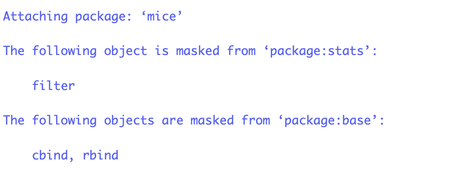

<style type="text/css">

body{ /* Normal  */
      font-size: 12px;
  }
td {  /* Table  */
  font-size: 12px;
}
h1.title {
  font-size: 18px;
  color: DarkBlue;
}
h1 { /* Header 1 */
  font-size: 18px;
}
h2 { /* Header 2 */
    font-size: 18px;
}
h3 { /* Header 3 */
  font-size: 18px;
}
code.r{ /* Code block */
    font-size: 12px;
}
pre { /* Code block - determines code spacing between lines */
    font-size: 14px;
}
</style>

---
# Modeling

## Modeling in `R`
To model objects based on other objects, we use the `~` (tilde) operator to construct an R model formula, a type of language object. 

For example, to model body mass index (BMI) on weight, we would type
```{r eval=FALSE}
BMI ~ weight
```
The `~` is used to separate the left- and right-hand sides in a model formula.

For functions (or models), within models we use `I()`
    - For example, to model body mass index (BMI) on its deterministic function of weight and height, we would type
```{r eval=FALSE}
BMI ~ I(weight / height^2)
```

```{r echo=FALSE, message=FALSE, warning=FALSE}
require(mice)
```

## Example
Remember the `boys` data from package `mice`:
```{r}
lm(bmi ~ wgt, data = boys)
```
```{r}
lm(bmi ~ I(wgt / (hgt / 100)^2), data = boys)
```

## Example continued
Remember the `boys` data from package `mice`:
```{r}
lm(bmi ~ I(wgt / (hgt / 100)^2), data = boys)
```

## Why we really need `I()` {.smaller}
Inside an R model formula, the the `+`, `:`, and `^` operators behave differently than when used in calculations with numeric vectors. Using `I()` converts these operators to their numerical meaning.
```{r}
lm(bmi ~ wgt + wgt^2, data = boys)
lm(bmi ~ wgt + I(wgt^2), data = boys)
```

## More efficient
It is 'nicer' to store the output from the function in an object. The convention for regression models is an object called `fit`. 
```{r}
fit <- lm(bmi ~ I(wgt / (hgt / 100)^2), data = boys)
```
The object `fit` contains a lot more than just the regression weights. To inspect what is inside you can use
```{r}
ls(fit)
```

## Inspecting what is inside `fit`
Another approach to inspecting the contents of `fit` is the function `attributes()`
```{r}
attributes(fit)
```

The benefit of using `attributes()` is that it directly tells you the class of the object. 

## Classes in R {.smaller}
```{r}
class(fit)
```

Classes are used for an object-oriented style of programming. This means that you can write a specific function that
- has fixed requirements with respect to the input. 
- presents output or graphs in a predefined manner. 

When a generic function `fun` is applied to an object with class attribute `c("first", "second")`, the system searches for a function called `fun.first` and, if it finds it, applies it to the object. 

If no such function is found, a function called `fun.second` is tried. If no class name produces a suitable function, the function `fun.default` is used (if it exists). If there is no class attribute, the implicit class is tried, then the default method.

## Classes example: plotting without class
```{r, dev.args = list(bg = 'transparent')}
plot(bmi ~ wgt, data = boys)
```

## Classes example: plotting with class
```{r, dev.args = list(bg = 'transparent')}
plot(lm(bmi ~ wgt, data = boys), which = 1)
```

## Classes example: plotting with class
```{r, dev.args = list(bg = 'transparent')}
plot(lm(bmi ~ wgt, data = boys), which = 2)
```

## Classes example: plotting with class
```{r, dev.args = list(bg = 'transparent')}
plot(lm(bmi ~ wgt, data = boys), which = 3)
```

## Classes example: plotting with class
```{r, dev.args = list(bg = 'transparent')}
plot(lm(bmi ~ wgt, data = boys), which = 4)
```

## Classes example: plotting with class
```{r, dev.args = list(bg = 'transparent')}
plot(lm(bmi ~ wgt, data = boys), which = 5)
```

## Classes example: plotting with class
```{r, dev.args = list(bg = 'transparent')}
plot(lm(bmi ~ wgt, data = boys), which = 6)
```

## Why is plot different for class `"lm"`?
The function `plot()` is called, but not used. Instead, because the linear model has class `"lm"`, `R` searches for the function `plot.lm()`. 

If function `plot.lm()` would not exist, `R` tries to apply function `plot()` (which would have failed in this case because plot requires `x` and `y` as input)

`plot.lm()` is created by John Maindonald and Martin Maechler. They thought it would be useful to have a standard plotting environment for objects with class `"lm"`. 

Since the elements that class `"lm"` returns are known, creating a generic function class is straightforward.  

# The blueprint of `R` 

## Layers in `R`
There are several 'layers' in `R`:

- The global environment
- User environments
- Functions
- Packages
- Namespaces

## Environments
The global environment can be seen as an Olympic-size swimming pool. Everything you do has its place there. 

If you'd like, you may create another, separate environment to work in. 

- A user environment would by default not have access to other environments

## Functions

- If you create a function, it is positioned in the global environment. 

- Everything that happens in a function, stays in a function. Unless you specifically tell the function to share the information with the global environment. 

- See functions as a shampoo bottle in a swimming pool to which you add some water. If you'd like to see the color of the mixture, you'd have to squeeze the bottle for it to come out. 

## Packages
- Packages have their own space. 

    - Everything needed to run the functions in a package is contained within its own space
    - See packages as separate (mini) pools that are connected to the main pool (the global environment)

## Packages

* When you start `RStudio` and `R` only the base packages are activated: the basic installation with basic functionality.
* There are about 20000 packages that have been developed by `R` users all over the world. Not efficient to have all these packages installed every time you use `R`.
* Install only the packages you want to use.
* Use `sessionInfo()` when you just started `RStudio` to see which packages are part of the basic installation:
```{r eval=FALSE}
sessionInfo()
```


## How to work with packages

Packages are like apps on your mobile phone. 

* When you want to use a package for the first time, you have to install the package.
* Each time you want to use the package, you have to "load" (activate) it. 

### Installing packages
The easiest way to install a package, e.g. `mice`, is to use:
```{r eval=FALSE}
install.packages("mice")
```

Alternatively, you can also do it in `RStudio` through 

`Tools --> Install Packages`

## Loading packages

There are two ways to load a package in `R`:
```{r eval=FALSE}
library(mice)
``` 
and
```{r eval=FALSE}
require(mice)
```

When a package is not found (not installed):

* `require()` will produce a warning and will continue to run the rest of the code.
* `library()` will produce an error and stop running the rest of the code.


## Namespaces and the `::` operator

Namespaces is an advanced topic and becomes important when you start to develop your own packages. Namespaces provide a context for looking up the value of an object associated with a name.

In daily practice you will often encounter the consequences when two different packages use the same name for a function. 

For example, the `plyr` package and the `Hmisc` package both have a function with the same name `summarize()`but not with the same functionality.

If you load `plyr` then `Hmisc`, `summarize()` will refer to the `Hmisc` version.
If you load `Hmisc` then `plyr`, `summarize()` will refer to the `plyr` version.

To avoid the confusion of not knowing which function is active, you can disambiguate the functions by using the `::` operator: 

`Hmisc::summarize()` and `plyr::summarize` will refer to the specific functions. Hence `::` serves as a namespace by providing the context where to look for the function `summarize`.

Then the order in which you loaded the packages does not matter anymore. 

# `R` in depth

## Workspaces and why you should sometimes save them
A workspace contains all changes you made to environments, functions and namespaces. 

A saved workspace contains everything at the time of the state wherein it was saved. 

You do not need to run all the previous code again if you would like to continue working at a later time. 

- You can save the workspace and continue exactly where you left. 

Workspaces are compressed and require relatively little memory when stored. The compression is very efficient and beats reloading large data sets from raw text. 

## History and why it is useful
`R` by default saves (part of) the code history and `RStudio` expands this functionality greatly. 

Most often it may be useful to look back at the code history for various reasons.

- There are multiple ways to access the code history.
  
    1. Use arrow up in the console. This allows you to go back in time, one codeline by one. Extremely useful to go back to previous lines for minor alterations to the code.
    2. Use the history tab in the environment pane. The complete project history can be found here and the history can be searched. This is particularly convenient when you know what code you are looking for. 
    
    
# Errors, warnings, messages

## Messages

If you simply get a message, without the words "Error" or "Warning", it is a message to inform you. The code runs as expected, but you are simply made aware of possible unwanted effects:



## Warning
When the message is preceded by "Warning": your code will still work, but with some caveats and will not produce the results you expect.
```{r}
z <- 1:5 
y <- 1:6  
z
y
z + y

```

## Errors

Generally when there is an error, the code will not run.

For example, we want to load the package `Hmisc` but it is not installed. We will get the following Error and the code will not run:


If you use `require(Hmisc)` instead, there will be a warning message and the rest of the code (if there is any) will be executed:


# Programming tips and organising your work

## Some programming tips:
- keep your code tidy
- use comments (text preceded by `#`) to clarify what you are doing
    - If you look at your code again, one month from now: you will not know what you did --> unless you use comments 

- when working with functions, use the TAB key to quickly access the help for the function's components
- work with logically named `R`-scripts
    - indicate the sequential nature of your work
- work with `RStudio` projects
- if allowed, place your project folders in some cloud-based environment

## Use `RStudio Projects`

Every time you start a new data analysis project, create a new `RStudio Project`. 

**Because you want your project to work:**

* not only now, but also in a few years;
* when the folder and file paths have changed;
* when collaborators want to run your code on their computer.

`RStudio Projects` create a convention that guarantees that the project can be moved around on your computer or onto other computers and will still “just work”:

* all code and outputs are stored in one set location;
* relative file paths are created;
* a clean R environment is created every time you open it;
* every project can have its own version control system and history;
* RStudio projects can relate to Git (or other online) repositories.

## Example data analysis project with `RStudio project`

Every time you want to work on this project: open the project by clicking the `.Rproj` file.


    
# `R`-coding <br> <br> The Google style guide

# Naming conventions

## File Names
File names should end in `.R` and, of course, be meaningful. 

GOOD:
```{r eval=FALSE}
predict_ad_revenue.R
```

<font color="red">BAD: </font>
```{r eval=FALSE}
foo.R
```

## Identifiers

Don't use underscores ( _ ) or hyphens ( - ) in identifiers. Identifiers should be named according to the following conventions. 

1. The preferred form for variable names is all lower case letters and words separated with dots (variable.name), but variableName is also accepted; 
2. function names have initial capital letters and no dots (FunctionName); 
3. constants are named like functions but with an initial k.

## Identifiers (continued)
- variable.name is preferred, variableName is accepted \
  GOOD: `avg.clicks` \
  OK: `avgClicks` \
  <font color="red">BAD: `avg_Clicks`</font>

- FunctionName \
  GOOD: `CalculateAvgClicks` \
  <font color="red">BAD: `calculate_avg_clicks` , `calculateAvgClicks` </font> \
- `kConstantName`

# Syntax

## Line Length

The maximum line length is 80 characters.

```{r}
# This is to demonstrate that at about eighty characters you would move off of the page

# Also, if you have a very wide function
fit <- lm(age ~ bmi + hgt + wgt + hc + gen + phb + tv + reg + bmi * hgt + wgt * hgt + wgt * hgt * bmi, data = boys)

# it would be nice to pose it as
fit <- lm(age ~ bmi + hgt + wgt + hc + gen + phb + tv + reg + bmi * hgt 
          + bmi * wgt + wgt * hgt + wgt * hgt * bmi, data = boys)
#or
fit <- lm(age ~ bmi + hgt + wgt + hc + gen + phb + tv + reg 
          + bmi * hgt 
          + bmi * wgt
          + wgt * hgt 
          + wgt * hgt * bmi, 
          data = boys)
```


## Indentation

When indenting your code, use two spaces. `RStudio` does this for you!

Never use tabs or mix tabs and spaces. 

Exception: When a line break occurs inside parentheses, align the wrapped line with the first character inside the parenthesis.

## Spacing
Place spaces around all binary operators (=, +, -, <-, etc.). 

Exception: Spaces around ='s are optional when passing parameters in a function call.
```{r eval=FALSE}
lm(age ~ bmi, data=boys)
```
or
```{r eval=FALSE}
lm(age ~ bmi, data = boys)
```

## Spacing (continued)
Do not place a space before a comma, but always place one after a comma. 

GOOD:
```{r eval=FALSE}
tab.prior <- table(df[df$days.from.opt < 0, "campaign.id"])
total <- sum(x[, 1])
total <- sum(x[1, ])
```


## Spacing (continued)
<font color="red">BAD:
```{r eval=FALSE}
# Needs spaces around '<'
tab.prior <- table(df[df$days.from.opt<0, "campaign.id"])  
# Needs a space after the comma
tab.prior <- table(df[df$days.from.opt < 0,"campaign.id"])  
# Needs a space before <-
tab.prior<- table(df[df$days.from.opt < 0, "campaign.id"]) 
# Needs spaces around <-
tab.prior<-table(df[df$days.from.opt < 0, "campaign.id"])  
# Needs a space after the comma
total <- sum(x[,1])  
# Needs a space after the comma, not before 
total <- sum(x[ ,1])  
```
</font>

## Spacing (continued)
Place a space before left parenthesis, except in a function call.

GOOD: 
```{r eval=FALSE}
if (debug)
```

<font color="red">BAD:</font>
```{r eval=FALSE}
if(debug)
```

## Extra spacing
Extra spacing (i.e., more than one space in a row) is okay if it improves alignment of equals signs or arrows (<-).
```{r eval = FALSE}
plot(x    = x.coord,
     y    = data.mat[, MakeColName(metric, ptiles[1], "roiOpt")],
     ylim = ylim,
     xlab = "dates",
     ylab = metric,
     main = (paste(metric, " for 3 samples ", sep = "")))

```

Do not place spaces around code in parentheses or square brackets.

Exception: Always place a space after a comma.

## Extra spacing
GOOD:
```{r eval=FALSE}
if (debug)
x[1, ]
```

<font color="red">BAD:</font>
```{r eval=FALSE}
if ( debug )  # No spaces around debug
x[1,]  # Needs a space after the comma 
```

## In general...
- Use common sense and BE CONSISTENT.

- The point of having style guidelines is to have a common vocabulary of coding 
    - so people can concentrate on what you are saying, rather than on how you are saying it. 

- If code you add to a file looks drastically different from the existing code around it, the discontinuity will throw readers out of their rhythm when they go to read it. Try to avoid this.

## Concluding Day 1

Today you had perhaps your first experience with R and with coding. 

You may have noticed that computers are not that smart: you have to give very precise instructions without mistakes and ambiguous meaning.

Some tips to learn to code:

* Practice, practice, practice ...
* Learning to code goes smoother when you are working on a particular data project that is important to you, like analyzing your own data. Practice what you learn in this course on your own data asap.
* Use the "copy, paste, tweak" approach: use code made by others (plenty available on the web) and tweak it to make it useful for your project. 


