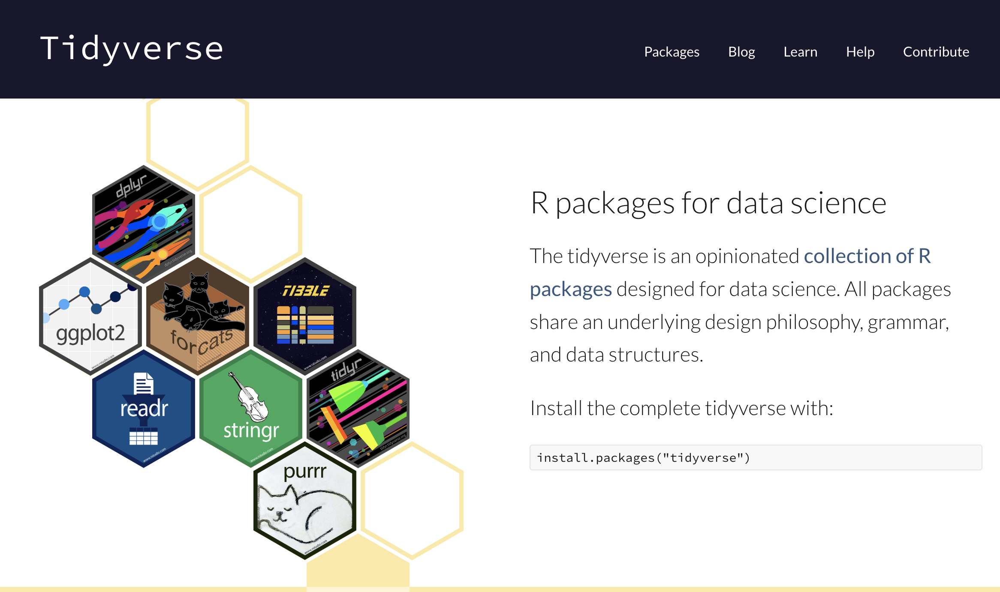
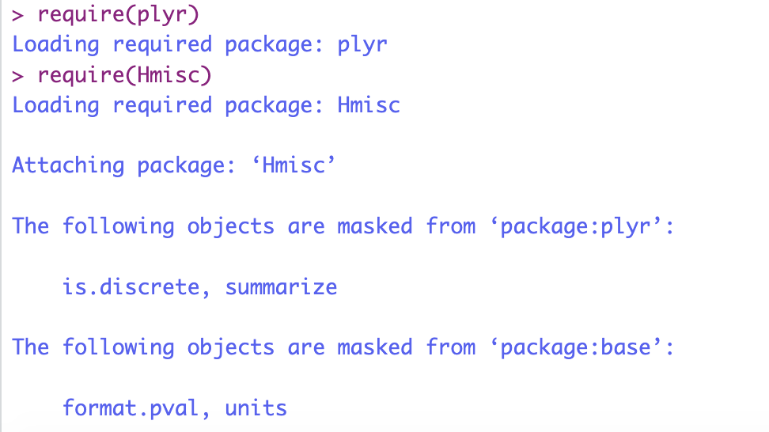
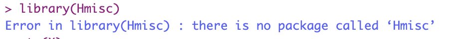
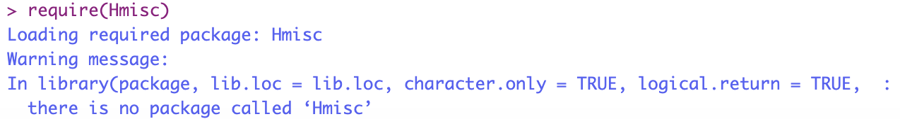

<style type="text/css">

body{ /* Normal  */
      font-size: 12px;
  }
td {  /* Table  */
  font-size: 12px;
}
h1.title {
  font-size: 18px;
  color: DarkBlue;
}
h1 { /* Header 1 */
  font-size: 18px;
}
h2 { /* Header 2 */
    font-size: 18px;
}
h3 { /* Header 3 */
  font-size: 18px;
}
code.r{ /* Code block */
    font-size: 12px;
}
pre { /* Code block - determines code spacing between lines */
    font-size: 14px;
}
</style>

---
## Topics

* Data manipulation (base R, tidyverse)
    + subsetting
* Importing data into `R`, exporting data
* Standard solves for missing data
* Modeling in `R`: the model formula
* Errors, warnings, messages
* Coding tips
* Google style guide

# Tidyverse

<center>

</center>

## Data transformation with `dplyr` (tidyverse)


`dplyr` is a very useful package for data transformation and manipulation. See cheat sheet in R Studio, Help -> cheat sheets

Subsetting in base R with `[]`, `[[]]` and `$`

In `dplyr`, two important functions for subsetting:

`select()` : subset columns

`filter()` : subset rows

## Subset columns with `select()`{.smaller}

```{r echo=FALSE, message=FALSE, warning=FALSE}
set.seed(123)
D <- data.frame("V1" = rnorm(5),
                "V2" = rnorm(5, mean = 5, sd = 2), 
                "V3" = letters[1:5])
```
Remove second column with `select()`:

```{r }
# Remove second column:
require(plyr)
dplyr::select(D, -2) 
# with base R: D[, -2]
```

## Subset columns with `select()`{.smaller}

Other way to remove the second column
```{r}
D
dplyr::select(D, V1, V3)
# base R: D[, c(1,3)]
```

## Subset rows with `filter()`{.smaller}

```{r}
D
dplyr::filter(D, V1 < 0 & V2 > 1)
# with base R: D[D$V1 < 0 & D$V2 > 1, ]
```


# Importing data into `R`

## R data format and workspace: `.RData`

In Practical B you worked with the `boys` data which were stored in the `R` file format: `.RData`, an R workspace file. 

* A workspace contains all changes you made to your data and functions during a session. 
* Workspaces are compressed and require relatively little memory when stored. The compression is very efficient and beats reloading large data sets from raw text.

Open the `sleepdata.Rdata` file with:
```{r }
load("sleepdata.RData")
# Note: This code works if you have placed the sleepdata.RData file 
# in the same project folder as your Rmd file. You do not have to 
# specify a file path. 
```

## Data sets in R (packages)

R has many in-built data sets. The command `data()` will give a list of all in-built data sets (also the data included in the non-base packages that are activated). 

Open an in-built data set as follows:
```{r}
require(MASS) # load the package MASS that contains the mammals data.
data(mammals) # load the mammals data
```

## Importing delimited data files

Text files (.txt) can be imported in to R with:
```{r eval=FALSE}
read.table("mammalsleep.txt")
```

CSV (comma seperated values) files can be imported with:

```{r eval=FALSE}
read.csv("filename.csv", header=TRUE, sep=",") # for comma (,) separated files 

read.csv2("filename.csv", header=TRUE, sep=";") # for semicolons (;) separated files
```


## Read and write statistical data formats {.smaller}

There are many packages that facilitate importing/exporting other data formats from statistical software: 

* SPSS: the function `read_spss` from package `haven` (but also other data formats from Stata and SAS)
* Mplus: package `MplusAutomation`
* Stata: `read.dta()` in `foreign`
* SAS: `sasxport.get()` from package `Hmisc` 
* MS Excel: 
    + function `read.xlsx()` from package `openxlsx`
    + function `read_excel()` from package `readxl`

[`haven`](https://haven.tidyverse.org/index.html) by [Hadley Wickham](http://hadley.nz) provides wonderful functions to import and export many data types from software such as Stata, SAS and SPSS. 

For a short guideline to import multiple formats into `R`, see e.g. http://www.statmethods.net/input/importingdata.html. 


# Standard solves for missing values

## Dealing with missing values in `R`

Calculations based on missing values (NA's) are not possible in `R`:
```{r}
mean(c(1, 2, NA, 4, 5))
```

There are two easy ways to perform "listwise deletion":
```{r}
mean(c(1, 2, NA, 4, 5), na.rm = TRUE)
mean(na.omit(c(1, 2, NA, 4, 5)))
```


# Modeling in `R`

## The model formula
To model objects based on other objects, we use the `~` (tilde) operator to construct an **R model formula**, a type of **language object**.

For example, to model body mass index (BMI) on weight with a linear regression model, use the model formula `bmi ~ wgt` with the linear model function `lm()`:

```{r message=FALSE, warning=FALSE}
require(mice)
lm(formula = bmi ~ wgt, data = boys)
```
In this case, ``bmi` ~ `wgt` means "regress `bmi` on `weight`.

## The model formula

The model formula can also be used to plot create a scatterplot with `bmi` on the y-axis and `wgt` on the x-axis. 


```{r message=FALSE, warning=FALSE}
plot(formula = bmi ~ wgt, data = boys)
```

# More R functionality

## History and why it is useful

`R` by default saves (part of) the code history and `RStudio` expands this functionality greatly.

Most often it may be useful to look back at the code history for various reasons.

-   There are multiple ways to access the code history.

    1.  Use arrow up in the console. This allows you to go back in time, one codeline by one. Extremely useful to go back to previous lines for minor alterations to the code.
    2.  Use the history tab in the environment pane. The complete project history can be found here and the history can be searched. This is particularly convenient when you know what code you are looking for.

# Errors, warnings, messages

## Messages

If you simply get a message, without the words "Error" or "Warning", it is a message to inform you. The code runs as expected, but you are simply made aware of possible unwanted effects:



## Namespaces and the `::` operator {.smaller}

Namespaces is an advanced topic and becomes important when you start to develop your own packages. Namespaces provide a context for looking up the value of an object associated with a name.

In daily practice you will often encounter the consequences when two different packages use the same name for a function.

For example, the `plyr` package and the `Hmisc` package both have a function with the same name `summarize()`but not with the same functionality.

If you load `plyr` then `Hmisc`, `summarize()` will refer to the `Hmisc` version. If you load `Hmisc` then `plyr`, `summarize()` will refer to the `plyr` version.

To avoid the confusion of not knowing which function is active, you can disambiguate the functions by using the `::` operator:

`Hmisc::summarize()` and `plyr::summarize` will refer to the function in the specific package. Hence `::` serves as a namespace by providing the context where to look for the function `summarize`.

Then the order in which you loaded the packages does not matter anymore.


## Warning

When the message is preceded by "Warning": your code will still work, but with some caveats and will not produce the results you expect.

```{r}
z <- 1:5 
y <- 1:6  
z
y
z + y

```

## Errors

Generally when there is an error, the code will not run.

For example, we want to load the package `Hmisc` but it is not installed. We will get the following Error and the code will not run:



If you use `require(Hmisc)` instead, there will be a warning message and the rest of the code (if there is any) will be executed:




# Programming tips and organising your work

## Some tips to learn to code:

-   keep your code tidy
-   use comments (text preceded by `#`) to clarify what you are doing
    -   If you look at your code again, one month from now: you will not know what you did --\> unless you use comments
-   when working with functions, use the TAB key to quickly access the help for the function's components
-   work with logically named `R`-files
    -   indicate the sequential nature of your work
-   work with `RStudio` projects

## Use `RStudio Projects` {.smaller}

Every time you start a new data analysis project, create a new `RStudio Project`.

**Because you want your project to work:**

-   not only now, but also in a few years;
-   when the folder and file paths have changed;
-   when collaborators want to run your code on their computer.

`RStudio Projects` create a convention that guarantees that the project can be moved around on your computer or onto other computers and will still "just work":

-   all code and outputs are stored in one set location;
-   relative file paths are created;
-   a clean R environment is created every time you open it;
-   every project can have its own version control system and history;
-   RStudio projects can relate to Git (or other online) repositories.

## Some tips to learn to code:

Today you had perhaps your first experience with R and with coding.

You may have noticed that computers are not that smart: you have to give very precise instructions without mistakes and ambiguous meaning. Remember also the way computers store numerical values. 

-   Practice, practice, practice ...
-   Use the "copy, paste, tweak" approach: use code made by others (plenty available on the web) and tweak it to make it useful for your project.
- Learning to code goes smoother when you are working on a particular data project that is important to you, like analyzing your own data. Practice what you learn in this course on your own data.
- You become more organized in coding, as you focus on creating readable code. In the long run, this will result in you becoming a more efficient programmer. Remember: efficient code runs faster. 

# `R`-coding and tidy verse style guide

https://style.tidyverse.org/index.html


# Naming conventions

## File Names

File names should end in `.R` and, of course, be meaningful.

GOOD:

```{r eval=FALSE}
predict_ad_revenue.R
```

<font color="red">BAD: </font>

```{r eval=FALSE}
foo.R
```

## Spacing

Place spaces around all binary operators (=, +, -, \<-, etc.).

Exception: Spaces around ='s are optional when passing parameters in a function call.

```{r eval=FALSE}
lm(age ~ bmi, data=boys)
```

or

```{r eval=FALSE}
lm(age ~ bmi, data = boys)
```

## Spacing (continued)

Do not place a space before a comma, but always place one after a comma.

GOOD:

```{r eval=FALSE}
tab.prior <- table(df[df$days.from.opt < 0, "campaign.id"])
total <- sum(x[, 1])
total <- sum(x[1, ])
```

## Extra spacing

Extra spacing (i.e., more than one space in a row) is okay if it improves alignment of equals signs or arrows (\<-).

```{r eval = FALSE}
plot(x    = x.coord,
     y    = data.mat[, MakeColName(metric, ptiles[1], "roiOpt")],
     ylim = ylim,
     xlab = "dates",
     ylab = metric,
     main = (paste(metric, " for 3 samples ", sep = "")))

```

Do not place spaces around code in parentheses or square brackets.

Exception: Always place a space after a comma.

## Extra spacing

GOOD:

```{r eval=FALSE}
if (debug)
x[1, ]
```

<font color="red">BAD:</font>

```{r eval=FALSE}
if ( debug )  # No spaces around debug
x[1,]  # Needs a space after the comma 
```

## Spacing (continued)

<font color="red">BAD:

```{r eval=FALSE}
# Needs spaces around '<'
tab.prior <- table(df[df$days.from.opt<0, "campaign.id"])  
# Needs a space after the comma
tab.prior <- table(df[df$days.from.opt < 0,"campaign.id"])  
# Needs a space before <-  #Using alt/option - creates the correct spacing
tab.prior<- table(df[df$days.from.opt < 0, "campaign.id"]) 
# Needs spaces around <-  #Using alt/option - creates the correct spacing
tab.prior<-table(df[df$days.from.opt < 0, "campaign.id"])  
# Needs a space after the comma
total <- sum(x[,1])  
# Needs a space after the comma, not before 
total <- sum(x[ ,1])  
```

</font>

## Identifiers

Don't use underscores ( \_ ) or hyphens ( - ) in identifiers. Identifiers should be named according to the following conventions.

1.  The preferred form for variable names is all lower case letters and words separated with dots (variable.name), but variableName is also accepted;
2.  function names have initial capital letters and no dots (FunctionName);
3.  constants are named like functions but with an initial k.

## Identifiers (continued)

-   variable.name is preferred, variableName is accepted\
    GOOD: `avg.clicks`\
    OK: `avgClicks`\
    <font color="red">BAD: `avg_Clicks`</font>

-   FunctionName\
    GOOD: `CalculateAvgClicks`\
    <font color="red">BAD: `calculate_avg_clicks` , `calculateAvgClicks` </font>\

-   `kConstantName`

# Syntax

## Line Length

The maximum line length is 80 characters.

```{r}
# This is to demonstrate that at about eighty characters you would move off of the page

# Also, if you have a very wide function
fit <- lm(age ~ bmi + hgt + wgt + hc + gen + phb + tv + reg + bmi * hgt + wgt * hgt + wgt * hgt * bmi, data = boys)

# it would be nice to pose it as
fit <- lm(age ~ bmi + hgt + wgt + hc + gen + phb + tv + reg + bmi * hgt 
          + bmi * wgt + wgt * hgt + wgt * hgt * bmi, data = boys)
#or
fit <- lm(age ~ bmi + hgt + wgt + hc + gen + phb + tv + reg 
          + bmi * hgt 
          + bmi * wgt
          + wgt * hgt 
          + wgt * hgt * bmi, 
          data = boys)
```

## Indentation

When indenting your code, use two spaces. `RStudio` does this for you!

Never use tabs or a mix of tabs and spaces.

Exception: When a line break occurs inside parentheses, align the wrapped line with the first character inside the parenthesis.


## In general...

-   Use common sense and BE CONSISTENT.

-   The point of having style guidelines is to have a common vocabulary of coding

    -   so people can concentrate on what you are saying, rather than on how you are saying it.

-   If code you add to a file looks drastically different from the existing code around it, the discontinuity will throw readers out of their rhythm when they go to read it. Try to avoid this.

