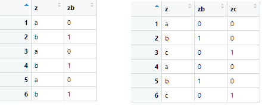

```{r include = FALSE}
knitr::opts_chunk$set(comment = "", warning = F)
library(ggplot2)
library(magrittr)
library(dplyr)
library(gridExtra)
```


## Content

1. The linear model `lm()`

2. Simple regression

    + continuous predictors
    
    + categorical predictors
    
3. Multiple regression

   + main effect models
   
   + interaction models

4. Residual plots


## Linear Model

The linear regression model:

$$y_i=\beta_0+\beta_{1} x_{i1}+\beta_2x_{i2}+\dots+\varepsilon_i, \ \ \ \ \ \  \varepsilon_i\sim N(0, \sigma^2)$$
where

- $y_i$ is score of individual $i$ on the numeric dependent variable $Y$

- $x_{i1}$ is the score of individual $i$ on predictor $X_1$  

- $\beta_0$ is the intercept 

- $\beta_1$ is the slope of $X_1$

- $\varepsilon_{i}$ is the residual (prediction error)

- $\sigma^2$ is the variance of the residuals


## The `lm()` function

```{r eval = FALSE}
lm(formula, data) # returns an object of class lm
```

formula        | model
:--------------|--------------------------
`y ~ 1`        | intercept-only
`y ~ x1`       | main effect of x1
`y ~ x1 + x2`  | main effects of x1, x2
`y ~ .`        | main effects of all predictors
`y ~ . - x1`   | main effects of all predictors except x1
`y ~ x1 + x2 + x1:x2`    | main effects + interaction between x1 and x2
`y ~ x1*x2`      | idem
`y ~ .^2`      | main effects + pairwise interactions between all predictors


# Simple regression


## Continuous predictor 

$$y_i=\hat{y}_i+\varepsilon_i$$
where
$$\hat{y}_i=\beta_0 + \beta_1x_i$$

<br>

- $\hat{y}_i$ is the fitted value of $y_i$ for $X=x_i$

- $x_i$ is the score on the numeric predictor 

- $\varepsilon_i$ is the residual

- $\beta_0$ is the fitted value for $X = 0$

- $\beta_1$ is the change in the fitted value for unit increase in $X$

## `mtcars` data

The help file of the `mtcars` data provides the following information on the data:

*The data was extracted from the 1974 Motor Trend US magazine, and comprises fuel consumption and 10 aspects of automobile design and performance for 32 automobiles (1973–74 models).*

We will consider the following three variables of this data set:

* `mpg` (numerical): miles per gallon, the determinant of fuel efficiency.
* `disp` (numerical): displacement measures overall volume in the engine as a factor of cylinder circumference, depth and total number of cylinders. This metric gives a good proxy for the total amount of power the engine can generate.
* `gear` (numeric): Number of forward gears. Number of gears in the transmission. Manual transmissions have either 4 or 5 forward gears; Automatic either 3 or 4.

## Information about the data set

```{r}
str(mtcars)
```


## Linear model

```{r include = params$answer}
lm(formula = mpg ~ disp, data = mtcars)
```
For `disp = 0`, the predicted value of `mpg` is 29.6

For each unit increase in `disp`, the predicted value of `mpg` decreases with 0.041

(i.e. cars with higher engine power consume more fuel)

## The `lm` object

Extracting information from an `lm` object called `fit`:

Function / Subsetting | Output
-------------------|-------------------------
`summary(fit)`       | summary of the model
`coef(fit) / fit$coef`          | coefficients
`coef(summary(fit)) / summary(fit)$coef`   | coefficients, SEs, $t$-values, $p$-values
`fitted(fit) / fit$fitted`        | fitted values
`resid(fit) / fit$resid`         | residuals
`anova(fit)`         | ANOVA table 
`plot(fit)`          | residual plots

## Extracting the coefficients

```{r include = params$answer}
summary(lm(mpg ~ disp, mtcars))$coef %>% round(3)
```

The intercept is significantly different from 0

The slope is significantly different from 0


## Scatterplot

Display a scatter plot with linear regression line for the previous model. 

```{r  include = params$answer, echo = FALSE, message = FALSE, fig.align = "center"}
ggplot(mtcars, aes(disp, mpg)) +
  geom_point() +
  geom_smooth(method = "lm", se = F)
```


## Categorical predictor 

A predictor with $k$ categories is converted into $k-1$ dummy variables.

- one dummy per category, except for the reference category

- dummy has value $1$ for corresponding category and $0$ otherwise

- the reference category has value $0$ on all dummies 

<br>

```{r echo = FALSE, out.width = "70%", fig.cap = "Reference category of $z$ is $a$", fig.align = "center"}

```


## Interpreting dummies

Model with two dummies $zb$ and $zc$:

$$\hat{y}=\beta_0+\beta_1zb+\beta_2zc$$

<br>

- $\beta_0$ is fitted value for $z=a$ (reference category)

- $\beta_0+\beta_1$ is the fitted value for $z=b$

- $\beta_0+\beta_2$ is the fitted value for $z=c$ 


## Linear model with `gear` as factor

`gear` is a categorical variable and has values 3, 4, 5, and has data type numeric. 
```{r}
lm(mpg ~ factor(gear), mtcars)
```

- mean `mpg` for 3 gears is 16.107

- mean `mpg` for 4 gears is 16.107 + 8.427 

- mean `mpg` for 5 gears is 16.107 + 5.273 


## Regression lines

Two plots, each with reference category `gear = 3`

```{r message = FALSE, fig.asp = 0.4, echo=F}
grid.arrange(
  mtcars %>% filter(gear != 5) %>%  
    ggplot(aes(gear, mpg)) + 
    geom_point() + 
    geom_smooth(method = "lm", se = F) + 
    scale_x_continuous(breaks = c(3, 4)) +
    ggtitle("slope for gear = 4"),
  mtcars %>% filter(gear != 4) %>% 
    ggplot(aes(gear, mpg)) + 
    geom_point() + 
    geom_smooth(method = "lm", se = F) + 
    scale_x_continuous(breaks = c(3, 5)) +
    ggtitle("slope for gear = 5"),
  nrow = 1)
```

## Model summary

Summary of model statistics

```{r echo = FALSE}
summary(lm(formula = mpg ~ factor(gear), data = mtcars))
```


## Model comparisons with `anova()`

Which model fits better: 

1. `mpg ~ 1`

2. `mpg ~ gear`  

3. `mpg ~ factor(gear)`

<br>

Each subsequent model has one more parameter, so it is expected to fit better.

- But is it significantly better?

<br>

We can check this with an $F$-test for the $R^2$-change

- The function to do this test is `anova(model 1, model 2, model 3)`


## Which model fits best?

Test the $R^2$-change for the 3 models on the previous slide

- which model fits best?

```{r  include = params$answer}
anova(lm(formula = mpg ~ 1, data = mtcars),
      lm(formula = mpg ~ gear, data = mtcars),
      lm(formula = mpg ~ factor(gear), data = mtcars))
```

Model 3 fits best.


# Multiple regression

## Main-effects model

No interactions in the model, e.g.

$$\hat{y}=\beta_0+\beta_1x_1+\beta_2x_2$$
<br>

Interpretation

- the slope of $x_1$ does not depend on $x_2$

- the slope of $x_2$ does not depend on $x_1$

- the slopes of $x_1$ and $x_2$ are corrected for the correlation $r_{x_1,x_2}$

## Model with `disp` and `gear`

Slopes corrected for correlation `disp` and `gear` $(r = -0.56)$

Slope for `disp` and `gear` in simple regression models
```{r}
c(lm(formula = mpg ~ disp, data = mtcars)$coef[2], 
  lm(formula = mpg ~ gear, data = mtcars)$coef[2])
```

Slope for `disp` and `gear` in multiple regression model
```{r}
lm(formula = mpg ~ disp + gear, data = mtcars)$coef[2:3]
```

## Interaction model

An interaction effect is (literally) the product of two predictors:

$$\hat{y}=\beta_0+\beta_1x_1+\beta_2x_2 + \beta_{12}x_1x_2$$

- The main effects should always be included too!

Interpreting the interaction effect

- The slope of $x_1$ is $\beta_1+\beta_{12}x_2$.
 
- The slope of $x_2$ is $\beta_2+\beta_{12}x_1$.


## Model summary

```{r}
summary(lm(formula = mpg ~ disp * factor(gear), data = mtcars)) 
```


## Regression plots


```{r echo = FALSE, message = FALSE, fig.asp = .4}
grid.arrange(
  
  ggplot(mtcars, aes(disp, mpg, col = factor(gear))) +
  geom_point() +
  geom_line(aes(y = predict(lm(mpg ~ disp + factor(gear), mtcars))), linewidth = 1) +
    ggtitle("main effects model"),
  
  ggplot(mtcars, aes(disp, mpg, col = factor(gear))) +
  geom_point() +
  geom_smooth(method = "lm", se = F) +
    ggtitle("interaction model"),
  
  nrow = 1)
```


## Compare the models 

Compare and interpret the fit of the following models

- intercept-only

- model with `disp` predicting `mpg`

- main effects model with `disp` and `factor(gear)` predicting `mpg`

- interaction model with `disp` and `factor(gear)` predicting `mpg`

## Results

```{r  include = params$answer}
anova(lm(formula = mpg ~ 1, data = mtcars),
      lm(formula = mpg ~ disp, mtcars),
      lm(formula = mpg ~ disp + factor(gear), mtcars),
      lm(formula = mpg ~ disp * factor(gear), mtcars))

```

# Residual plots


## Residuals vs Fitted

**linearity**

- approximately straight red line at 0

```{r fig.width = 5, echo=F, fig.align = 'center'}
plot(lm(formula = mpg ~ disp * factor(gear), data = mtcars), which = 1)
```

## Normal Q-Q

**Normally distributed residuals**

- residuals approximately on diagonal 

```{r fig.width = 5, echo=F, fig.align = 'center'}
plot(lm(formula = mpg ~ disp * factor(gear), data = mtcars), which = 2)
```


## Scale-Location**

**Homoscedasticity (constant variance residuals)**

- approximately straight red line

```{r fig.width = 5, echo=F, fig.align = 'center'}
plot(lm(formula = mpg ~ disp * factor(gear), mtcars), which = 3)
```

## Residuals vs Leverage

**Influential data points**

- data points with a Cook's Distance larger than 1


```{r fig.width = 5, fig.align = 'center', echo=F}
plot(lm(formula = mpg ~ disp * factor(gear), data = mtcars), which = 5)
```

