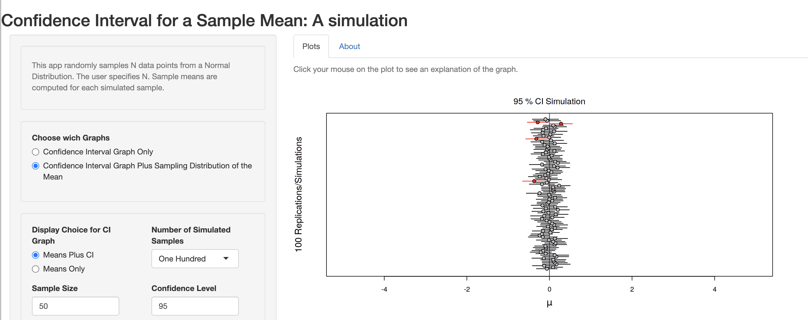

## Topics this lecture

- Probability distributions in `R`

- A review of statistical inference concepts

## Probability distributions

-  Normal distributions

    -  Linear model
    -  error distribution is normal

-  Discrete distributions (counts)

    -  Bernoulli, Binomial or Poisson model
    -  error distribution not normal

-  Other continuous distributions 

    -  Uniform, exponential 
    -  error distribution not normal

## Probability distributions in R {.smaller}

R has a system to work with probability distributions. For example the normal distribution:

`dnorm()`: **d** for density function

`pnorm()`: **p** for cumulative distribution $P(X \leqslant x)$

`qnorm()`: **q** for p-quantile

`rnorm()`: **r** for pseudo-random normally distributed numbers

For other distributions, replace `norm` with: `f, chisq, binom, pois, exp, unif, gamma, beta, t`

Example: obtain critical *z*-value for a 2-sided 95% confidence interval:
```{r}
qnorm(0.975) # default: mean=0, sd=1
```

# A review of inference concepts

## Parameters and statistics
Random sample 

- set of values drawn independently from a population

Population parameter 

- Property of the population (e.g. $\mu,\sigma,\rho$) 

Sample statistic 

- Property of the sample (e.g. $\bar{x},s,r$) 

## Sampling distributions
The sampling distribution is the distribution of a sample statistic

### Central Limit Theorem

- **Given a distribution with mean $\mu$ and standard deviation $\sigma$, the sampling 
distribution of the mean approaches a normal distribution with mean $\mu$ and standard deviation $\frac{\sigma}{\sqrt{n}}$ as $n\to\infty$ **

Conditions for the CLT to hold

- $\mu$ and $\sigma$ known
- the sample size $n$ is sufficiently large

# Hypothesis tests and confidence intervals

## Hypothesis tests
Statistical tests work with a null hypothesis, e.g.:
$$
H_0:\mu=\mu_0
$$

- If population parameters $\mu$ and $\sigma$ are unknown, we need to use sample mean $\bar{x}$ and sample standard deviation $s$ as estimators 
- as a consequence, the sample mean has a $t$-distribution


$$
t_{(df)}=\frac{\bar{x}-\mu_0}{SEM}
$$


## $t$-distribution
The $t$-distribution has larger variance than the normal distribution (more uncertainty). 
   
- degrees of freedom: $df=n-$ number of estimated means
- the higher the degrees of freedom (the larger the sample)
  the more it resembles a normal distribution
    
## $t$-distribution vs normal {.smaller}
```{r dev.args = list(bg = 'transparent'), fig.height=4}
curve(dt(x, 100), -3, 3, ylab = "density")
curve(dnorm(x), -3, 3, ylab = "", add = TRUE, col = "orange", lty=2)
curve(dt(x,   2), -3, 3, ylab = "", add = TRUE, col = "red")
curve(dt(x,   1), -3, 3, ylab = "", add = TRUE, col = "blue")
legend(1.8, .4, c("t(df=100)", "normal", "t(df=2)", "t(df=1)"), 
       col = c("black", "orange", "red", "blue"), lty=1)
```

## $p$-values
The $p$-value in this situation is the probability that $\bar{x}$ is at least that much different from $\mu_0$:

- P($\bar{X}$ $\geq$ $\bar{x}$ |$\mu$=0)

We would reject $H_0$ if $p$ is smaller than the experimenters' predetermined significance level $\alpha$: 

- two-sided test if $H_A:\mu\neq\mu_0$ (upper and lower ($\alpha$/2) * 100\%)
- one-sided test if $H_A:\mu>\mu_0$ or $H_A:\mu<\mu_0$ (upper or lower $\alpha$ * 100\%)

## $p$-values
Example of two-sided test for $t_{(df=10)}$ given that $P(t<-2.228)=5\%$ ($\alpha$ = 0.05)

```{r echo = FALSE, dev.args = list(bg = 'transparent')}
t0      <- qt(.05, 10)

cord.x1 <- c(-3, seq(-3, t0, 0.01), t0)
cord.y1 <- c(0, dt(seq(-3, t0, 0.01), 10), 0)
cord.x2 <- c(-t0, seq(-t0, 3, 0.01), 3)
cord.y2 <- c(0, dt(seq(-t0, 3, 0.01), 10), 0) 

curve(dt(x,10),xlim=c(-3,3),ylab="density",main='',xlab="t-value") 
polygon(cord.x1,cord.y1,col='red')
polygon(cord.x2,cord.y2,col='red')
```

## 95\% confidence interval {.smaller}
*If an infinite number of samples were drawn and CI's computed, then the true population mean $\mu$ would be in* ***at least*** *95\% of these intervals*

$$
95\%~CI=\bar{x}\pm{t}_{(1-\alpha/2)}\cdot SEM
$$

Example
```{r}
x.bar <- 7.6 # sample mean
SEM   <- 2.1 # standard error of the mean
n     <- 11 # sample size
df    <- n-1 # degrees of freedom
alpha <- .15 # significance level
t.crit <- qt(1 - alpha / 2, df) # t(1 - alpha / 2) for df = 10
c(x.bar - t.crit * SEM, x.bar + t.crit * SEM) 
```

## Conceptualisation of confidence intervals {.smaller}
To illustrate the concept of a confidence, see the following interactive applications:

* A Shiny app: https://shiny.rit.albany.edu/stat/confidence/

* An interactive visualisation: https://rpsychologist.com/d3/ci/

Both applications show the probability process of repeatedly estimating a 95% confidence interval. The interpretation of a 95% CI becomes more clear when you see the results of estimating 100 times a 95% CI for a sample mean. 

<center></center>

## Practical

During the practical you can work with a Markdown file that simulates the estimation of 100 confidence intervals for the mean. 

**Exercises**

1. Open the "Solutions" file and download the "Template" file (the R Markdown file).
2. Start with reading the "Solutions" file and try to understand what happens in each code chunk. If you do not understand what the code does, use the following possible strategies:
    + Consult the help file of the function
    + Run the code (in the Markdown file) line by line and inspect the output of the code in the "Environment" tab
    + When you understand the code, add comments in the code chunks (use `#` to start a comment).
3. Run the entire document by using the `Run All` option in the `Run` menu (upper right in the editor pane). Run the code again, but first change the seed at line 21. What do you observe?
